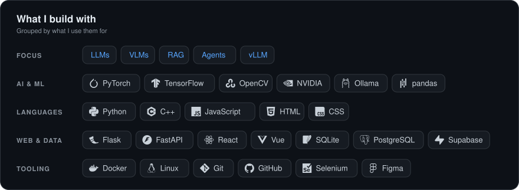

Give me a problem I don't know how to solve. 
I'll learn what I need, figure out the architecture and build the first version. 
Then I'll break it, debug it and ship it.

That's the skill I'm building.

I work on AI systems: language models, agents, vision, and the plumbing that makes them useful. I'm most interested in the layer between *"the model can generate"* and *"the system can actually do."*

## Experience

**Research Intern**, Department of Computer Science, IIT Madras

**Industry Interaction and placement systems**, IIT Madras

I built automation and data tools around the placement workflow:

- finding opportunities and scraping job posts
- cleaning the data and pulling structure out of it with LLMs
- keeping track of recruiter contacts
- dashboards for the placement team, and an AI interviewer

Some of it is public: [Placement Intelligence Platform](https://github.com/PrakashMohit/Placement-Intelligence-Platform), [Scrapers for IIC](https://github.com/PrakashMohit/Scrapers-For-IIC), [BlueBook automation](https://github.com/PrakashMohit/IITM_BlueBook_Automation) and [email automation](https://github.com/PrakashMohit/IITM-Email_Automation).

## What I'm building

- **[Whisper Piper Friday](https://github.com/PrakashMohit/AI_Agent-Whisper-Piper)**: a voice assistant that runs locally, around the loop perceive, think, act. Whisper for speech to text, Piper for speech, Ollama for the language model. 
  `voice` `memory` `tools` `reasoning` `automation`
- **Krishnos**: a personal LLM experiment. I'm trying to understand language models from the inside instead of treating them as black boxes. 
  `transformers` `training` `inference` `quantization`
- **Robotic arm VLA**: how vision-language models can go from understanding a scene to controlling a physical arm. 
  `vision` `VLM` `VLA` `robotics`
- **AI fashion system**: garment, try-on, styling and recommendation as one pipeline. 
  `multimodal AI` `computer vision` `personalization`
- **AgentSec-RM**: security research for AI agents, treated as continuous state estimation instead of classifying one event at a time. 
  `agents` `telemetry` `transformers` `security`
- **[Automation](https://github.com/PrakashMohit/Scrapers-For-IIC)**: scraping, data processing, extraction and outreach workflows, so nobody has to do them by hand. 
  `python` `LLMs` `infrastructure`

## What I build with

## This year on GitHub

## Find me

[LinkedIn](https://www.linkedin.com/in/prakash-mohit-a59b71259) · [Instagram](https://www.instagram.com/prakash_mohit_/) · [prakashmohit21x@gmail.com](mailto:prakashmohit21x@gmail.com)

*Build, break, learn, rebuild, ship.*
