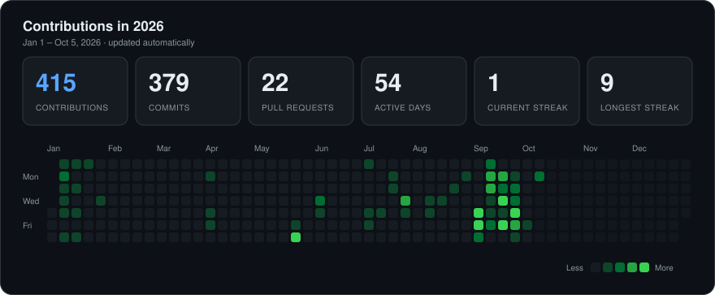

<div align="center">


<a href="https://github.com/PrakashMohit?tab=followers"></a>

<h2>⚡ I BUILD AI SYSTEMS THAT ACTUALLY DO THINGS.</h2>

<i>I like taking ideas from <b>concept → architecture → code → infrastructure → reality.</b></i>

</div>

<br>

<table>
<tr>
<td width="50%" valign="top">

### 🧠 What I'm obsessed with

```text
Artificial Intelligence
          ↓
     LLMs / VLMs
          ↓
        Agents
          ↓
    Tools + Memory
          ↓
      Reasoning
          ↓
        Action
          ↓
  Real-world Systems
```

I'm interested in the layer between
**"the model can generate"** and **"the system can actually do."**

</td>
<td width="50%" valign="top">

### ⚡ My biggest skill

<h2 align="center">I CAN MAKE IT HAPPEN.</h2>

Give me a problem I don't know how to solve.<br>
I'll learn what I need.<br>
I'll figure out the architecture.<br>
I'll build the first version.<br>
I'll break it.<br>
I'll debug it.<br>
I'll ship it.

**That's the skill I'm building.**

</td>
</tr>
</table>

<br>

<div align="center">

## 🌌 Currently exploring


</div>

<br>

<div align="center">

## 🚀 Things I'm building

</div>

<table>
<tr>
<td width="50%" valign="top">

### 🧠 Krishnos
**A personal LLM experiment**

Building and understanding language models from the inside rather than treating them as black boxes.

<code>Transformers</code> <code>Training</code> <code>Inference</code> <code>Quantization</code>

</td>
<td width="50%" valign="top">

### 🤖 [Whisper Piper Friday](https://github.com/PrakashMohit/AI_Agent-Whisper-Piper)
**Personal AI agent**

A local, voice-first assistant exploring the loop: <code>PERCEIVE → THINK → ACT</code>

Voice · Memory · Tools · Reasoning · Automation

<code>Whisper</code> <code>Piper</code> <code>Ollama</code> <code>Python</code>

</td>
</tr>
<tr>
<td width="50%" valign="top">

### 🦾 Robotic ARM VLA
**Vision → Language → Action**

Exploring how multimodal models can move from understanding the world to controlling physical systems.

<code>Vision</code> <code>VLM</code> <code>VLA</code> <code>Robotics</code>

</td>
<td width="50%" valign="top">

### 👕 AI Fashion System
**From wardrobe to intelligent styling**

Exploring the complete pipeline: <code>GARMENT → TRY-ON → STYLING → RECOMMENDATION</code>

Multimodal AI · Computer Vision · Personalization

</td>
</tr>
<tr>
<td width="50%" valign="top">

### 🔐 AgentSec-RM
**AI agent security research**

Exploring agent security as a continuous state-estimation problem rather than simply classifying isolated events.

<code>Agents</code> <code>Telemetry</code> <code>Transformers</code> <code>Security</code>

</td>
<td width="50%" valign="top">

### ⚙️ [Automation Systems](https://github.com/PrakashMohit/Scrapers-For-IIC)
**Making repetitive workflows disappear**

Building automation around scraping, data processing, intelligence extraction, outreach and internal workflows.

<code>Automation</code> <code>Python</code> <code>LLMs</code> <code>Infrastructure</code>

</td>
</tr>
</table>

<br>

<div align="center">

## 🧩 How I think about building

```text
 ┌──────────────┐
 │     IDEA     │
 └──────┬───────┘
        ↓
 ┌──────────────┐
 │ ARCHITECTURE │
 └──────┬───────┘
        ↓
 ┌──────────────┐
 │    MODEL     │
 └──────┬───────┘
        ↓
 ┌──────────────┐
 │    AGENT     │
 └──────┬───────┘
        ↓
 ┌──────────────┐
 │    TOOLS     │
 └──────┬───────┘
        ↓
 ┌──────────────┐
 │INFRASTRUCTURE│
 └──────┬───────┘
        ↓
 ┌──────────────┐
 │  REAL WORLD  │
 └──────────────┘
```

**Models are interesting.**<br>
**Systems built around them are more interesting.**

</div>

<br>

<div align="center">

## ⚙️ The stuff I build with


<br>


<br><br>


</div>

<br>

<div align="center">

## 🏗️ Where I've been building

</div>

<table width="100%">
<tr>
<td>

### IIT Madras — Industry Interaction / Placement Ecosystem

Built automation and intelligence systems around the placement workflow:

- 🔎 Opportunity discovery
- 🕷️ Job & post scraping
- 🧹 Data cleaning pipelines
- 🧠 AI-based extraction
- 📧 Recruiter intelligence
- 📊 Placement dashboards
- 🤖 AI interviewer systems

**Public work:**
[Placement Intelligence Platform](https://github.com/PrakashMohit/Placement-Intelligence-Platform) ·
[Scrapers for IIC](https://github.com/PrakashMohit/Scrapers-For-IIC) ·
[BlueBook Automation](https://github.com/PrakashMohit/IITM_BlueBook_Automation) ·
[Email Automation](https://github.com/PrakashMohit/IITM-Email_Automation)

</td>
</tr>
</table>

<div align="center">

<i>The role is temporary. The systems-building mindset isn't.</i>

</div>

<br>

<div align="center">

## ⚡ Building principles

</div>

<table>
<tr>
<td align="center" width="25%"><h3>🧠</h3><b>Understand</b><br>Don't blindly use abstractions.</td>
<td align="center" width="25%"><h3>🔨</h3><b>Build</b><br>Ideas become useful when they run.</td>
<td align="center" width="25%"><h3>🧪</h3><b>Break</b><br>Debugging is part of engineering.</td>
<td align="center" width="25%"><h3>🚀</h3><b>Ship</b><br>A working system beats a perfect idea.</td>
</tr>
</table>

<br>

<div align="center">

## 📊 GitHub activity



<br>


</div>

<br>

<div align="center">

## 🌐 Let's connect

<a href="https://www.linkedin.com/in/prakash-mohit-a59b71259"></a>
<a href="https://www.instagram.com/prakash_mohit_/"></a>
<a href="mailto:prakashmohit21x@gmail.com"></a>

<br><br>

### BUILD → BREAK → LEARN → REBUILD → SHIP

**If I don't know how to build it yet...**<br>
**I'LL FIGURE IT OUT. I'LL MAKE IT HAPPEN.**


</div>
